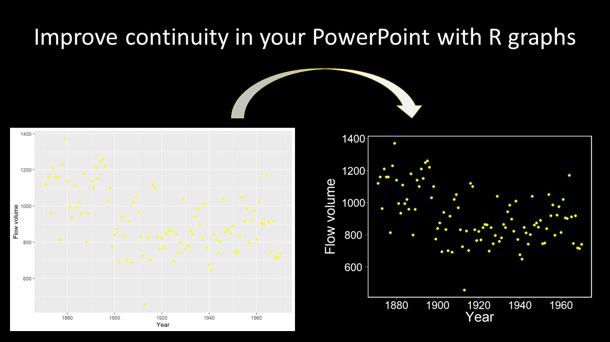

<center>

{width=700px}

</center>

## Why make a custom `ggplot` theme?

My original use for this was to make it easier to apply a theme to my ggplots for a PowerPoint presentation with a black background. I didn't want to have the black backgound and then a bright white graph . . . or a series of bright white graphs.

I wanted a black plot background with white axis lines, text, and labels. Then I could use different colors in my plot that showed up on a black background (like white, yellow, cyan, etc.). I also wanted to increase the width of lines to improve readability from the back of the presentation room.

Making your own custom themes has other applications as well, including manuscript preparation, report preparation, sharing graphics with others who like the look of Excel or SigmaPlot graphics, and so on.

## How to get started

We'll actually start with a current `ggplot` theme and then modify it. To find the underlying code behind any particular `ggplot` theme, you can type the theme name directly into the console:
```{r theme_bw, warning = FALSE}
library(ggplot2)
theme_bw
```

You'll notice that `theme_bw()` is actually based on a modification of `theme_grey()`, so we'll use that to our advantage to make our custom ggplot theme.

The `theme()` functions have nearly 100 elements that you can specify, so it's likely easier to build off an existing theme and modify/replace certain elements.

## Black background custom theme for PowerPoint slides

I chose to start with `theme_grey()` and modify what I wanted from there.

Some of the things I changed were:  
- increased font size throughout  
- axis text to white  
- legend text to white  
- black backround  
- white panel border (this also adds the axis lines since it's now a box around the plot)

You'll make your custom theme by making a new function, within which you will call up and modify a `ggplot` theme. Below I have included a bunch of the theme options, even if they are set to `NULL` so that you can copy and paste from here to give you a starting point with a bit more scope to it.
```{r BlackBkgrd, echo = TRUE}
theme_BlackBgrd = function(base_size = 24, base_family = "") {
  theme_grey(base_size = base_size, base_family = base_family) %+replace%
    theme(
      # Specify axis options
      axis.line = element_blank(),  
      axis.text.x = element_text(size = base_size*0.8, color = "white", lineheight = 0.9),  
      axis.text.y = element_text(size = base_size*0.8, color = "white", lineheight = 0.9),  
      axis.ticks = element_line(color = "white", size  =  0.2),  
      axis.title.x = element_text(size = base_size, color = "white", margin = margin(0, 10, 0, 0)),  
      axis.title.y = element_text(size = base_size, color = "white", angle = 90, margin = margin(0, 10, 0, 0)),  
      axis.ticks.length = unit(0.3, "lines"),   
      # Specify legend options
      legend.background = element_rect(color = NA, fill = "black"),  
      legend.key = element_rect(color = NA,  fill = "black"),  
      legend.key.size = unit(1.2, "lines"),  
      legend.key.height = NULL,  
      legend.key.width = NULL,      
      legend.text = element_text(size = base_size*0.8, color = "white"),  
      legend.title = element_text(size = base_size*0.8, face = "bold", hjust = 0, color = "white"),  
      legend.position = "right",  
      legend.text.align = NULL,  
      legend.title.align = NULL,  
      legend.direction = "vertical",  
      legend.box = NULL, 
      # Specify panel options
      panel.background = element_rect(fill = "black", color  =  NA),  
      panel.border = element_rect(fill = NA, color = "white"),
      panel.grid.major = element_line(color = NA),  
      panel.grid.minor = element_line(color = NA), 
      panel.spacing = unit(0.5, "lines"),   
      # Specify facetting options
      strip.background = element_rect(fill = "grey30", color = "grey10"),  
      strip.text.x = element_text(size = base_size*0.9, color = "white", face = "bold.italic"),  
      strip.text.y = element_text(size = base_size*0.4, color = "white",face = "bold.italic", angle = -90),  
      # Specify plot options
      plot.background = element_rect(color = "black", fill = "black"),  
      plot.title = element_text(size = base_size*1.2, color = "white"),  
      plot.margin = unit(rep(1, 4), "lines")
    )
}
```

After running your function, it should show up in your Environment. Now we can use it for any ggplot. We'll use a built-in dataset for this, the flow of the Nile River.

First let's see how it looks with the default ggplot theme:
```{r DefaultTheme, echo=TRUE}
# The Nile dataset contains river flow over time from 1871 to 1970
# Check out a quick plot of the dataset 
Flow <- as.vector(Nile)
Year <- seq(1871, 1970, by = 1)
Nile <- as.data.frame(cbind(Flow, Year))

ggplot(Nile, aes(x = Year, y = Flow)) +
  geom_point(color = "yellow", size = 2) +
  labs(x = "Year", y = "Flow volume") +
  scale_x_continuous(breaks = seq(1860, 1980, 20))
```
```{r CustomTheme, echo = TRUE}
# Now apply our custom theme
MyPlot <- ggplot(Nile, aes(x = Year, y = Flow)) +
  geom_point(color = "yellow", size = 2) +
  labs(x = "Year", y = "Flow volume") +
  scale_x_continuous(breaks = seq(1860, 1980, 20)) +
  theme_BlackBgrd()
MyPlot
```

From here you can save/export your plots and put them into your PowerPoint presentation.

You have lots of options for custom `ggplot` themes. Make them work for you! My next application for custom ggplot themes will be within annual reports for our program.


## FWRI R Club Announcements

<span style="color:green">Our next [remote/virtual] meeting is scheduled for **September 8, 2020 at 2 pm eastern time**.</span>

I'm still looking for volunteers to present something at a meeting of your choice; please consider sharing your skills with the group. Or, if you're stuck on something and want feedback from the group, we can help!

Email if you're interested in presenting or if you have a topic you'd like someone else to present.

Thanks!